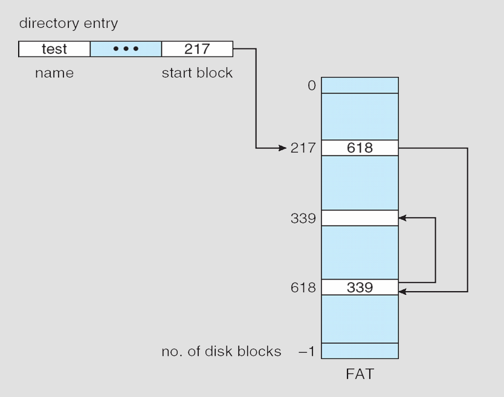
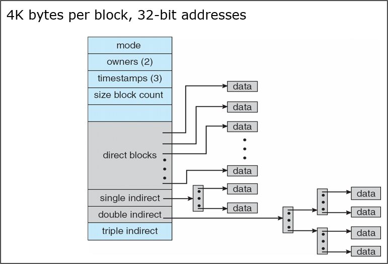
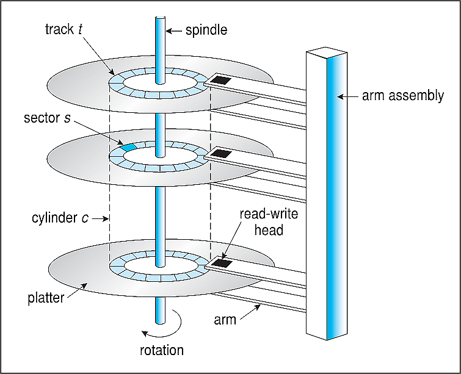
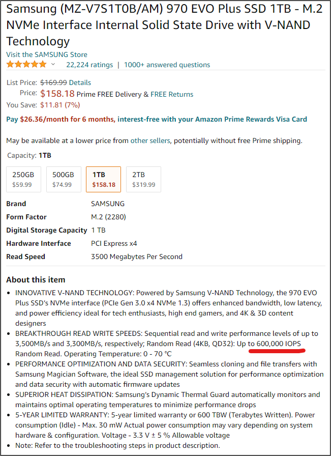

# Lesson 13 Prepare: File Systems

Section | Content
--- | ---

:key: = Vital concepts that we will continue to build on in coming lessons / key learning outcomes for this course.

# Overview

The reason to learn about file systems is that they effect execution times of programs.  In particular, concurrent and parallel programs.

## File Systems

### FAT

File Allocation Table (FAT) is a file system developed for personal computers. Originally developed in 1977 for use on floppy disks, it was adapted for use on hard disks and other devices. It is often supported for compatibility reasons by current operating systems for personal computers and many mobile devices and embedded systems, allowing interchange of data between disparate systems. The increase in disk drives capacity required three major variants: FAT12, FAT16 and FAT32. The FAT standard has also been expanded in other ways while generally preserving backward compatibility with existing software.

FAT is no longer the default file system for Microsoft Windows computers.

FAT file systems are still commonly found on floppy disks, flash and other solid-state memory cards and modules (including USB flash drives), as well as many portable and embedded devices. FAT is the standard file system for digital cameras per the DCF specification.


### NTFS

NTFS (New Technology File System) is a proprietary journaling file system developed by Microsoft. Starting with Windows NT 3.1, it is the default file system of the Windows NT family.

NTFS has several technical improvements over the file systems that it superseded – File Allocation Table (FAT) and High Performance File System (HPFS) – such as improved support for metadata and advanced data structures to improve performance, reliability, and disk space use. Additional extensions are a more elaborate security system based on access control lists (ACLs) and file system journaling.

NTFS is supported in other desktop and server operating systems as well. Linux and BSD have a free and open-source NTFS driver, called NTFS-3G, with both read and write functionality. macOS comes with read-only support for NTFS.


### exFAT

exFAT (Extensible File Allocation Table) is a file system introduced by Microsoft in 2006 and optimized for flash memory such as USB flash drives and SD cards. exFAT was proprietary until 28 August 2019, when Microsoft published its specification. Microsoft owns patents on several elements of its design.

exFAT can be used where NTFS is not a feasible solution (due to data-structure overhead), but a greater file-size limit than the standard FAT32 file system (i.e. 4 GiB) is required.

exFAT has been adopted by the SD Association as the default file system for SDXC cards larger than 32 GB.


### APFS

Apple File System (APFS) is a proprietary file system developed and deployed by Apple Inc. for macOS Sierra (10.12.4) and later, iOS 10.3 and later, tvOS 10.2 and later, watchOS 3.2 and later, and all versions of iPadOS. It aims to fix core problems of HFS+ (also called Mac OS Extended), APFS's predecessor on these operating systems. APFS is optimized for solid-state drive storage and supports encryption, snapshots, and increased data integrity, among other capabilities.

### HFS+

HFS Plus or HFS+ (also known as Mac OS Extended or HFS Extended) is a journaling file system developed by Apple Inc. It replaced the Hierarchical File System (HFS) as the primary file system of Apple computers with the 1998 release of Mac OS 8.1. HFS+ continued as the primary Mac OS X file system until it was itself replaced with the Apple File System (APFS), released with macOS High Sierra in 2017. HFS+ is also one of the formats used by the iPod digital music player.

Compared to its predecessor HFS, also called Mac OS Standard or HFS Standard, HFS Plus supports much larger files (block addresses are 32-bit length instead of 16-bit) and using Unicode (instead of Mac OS Roman or any of several other character sets) for naming items. Like HFS, HFS Plus uses B-trees to store most volume metadata, but unlike most other file systems, HFS Plus supports hard links to directories. HFS Plus permits filenames up to 255 characters in length, and n-forked files similar to NTFS, though until 2005 almost no system software took advantage of forks other than the data fork and resource fork. HFS Plus also uses a full 32-bit allocation mapping table rather than HFS's 16 bits, improving the use of space on large disks.


### ext2

The ext2 or second extended file system is a file system for the Linux kernel. It was initially designed by French software developer Rémy Card as a replacement for the extended file system (ext). Having been designed according to the same principles as the Berkeley Fast File System from BSD, it was the first commercial-grade filesystem for Linux.


### ext3

ext3, or third extended filesystem, is a journaled file system that is commonly used by the Linux kernel. It used to be the default file system for many popular Linux distributions. Stephen Tweedie first revealed that he was working on extending ext2 in Journaling the Linux ext2fs Filesystem in a 1998 paper, and later in a February 1999 kernel mailing list posting. The filesystem was merged with the mainline Linux kernel in November 2001 from 2.4.15 onward.4] Its main advantage over ext2 is journaling, which improves reliability and eliminates the need to check the file system after an unclean shutdown. Its successor is ext4.


### ext4

The ext4 journaling file system or fourth extended filesystem is a journaling file system for Linux, developed as the successor to ext3.

ext4 was initially a series of backward-compatible extensions to ext3, many of them originally developed by Cluster File Systems for the Lustre file system between 2003 and 2006, meant to extend storage limits and add other performance improvements. However, other Linux kernel developers opposed accepting extensions to ext3 for stability reasons, and proposed to fork the source code of ext3, rename it as ext4, and perform all the development there, without affecting existing ext3 users. This proposal was accepted, and on 28 June 2006, Theodore Ts'o, the ext3 maintainer, announced the new plan of development for ext4.

A preliminary development version of ext4 was included in version 2.6.19 of the Linux kernel. On 11 October 2008, the patches that mark ext4 as stable code were merged in the Linux 2.6.28 source code repositories, denoting the end of the development phase and recommending ext4 adoption. Kernel 2.6.28, containing the ext4 filesystem, was finally released on 25 December 2008. On 15 January 2010, Google announced that it would upgrade its storage infrastructure from ext2 to ext4. On 14 December 2010, Google also announced it would use ext4, instead of YAFFS, on Android 2.3.


### ZFS

ZFS (previously: Zettabyte file system) combines a file system with a volume manager. It began as part of the Sun Microsystems Solaris operating system in 2001. Large parts of Solaris – including ZFS – were published under an open source license as OpenSolaris for around 5 years from 2005, before being placed under a closed source license when Oracle Corporation acquired Sun in 2009/2010. During 2005 - 2010, the open source version of ZFS was ported to Linux, Mac OS X (continued as MacZFS) and FreeBSD. In 2010, the illumos project forked a recent version of OpenSolaris, to continue its development as an open source project, including ZFS. In 2013 OpenZFS was founded to coordinate the development of open source ZFS. OpenZFS maintains and manages the core ZFS code, while organizations using ZFS maintain the specific code and validation processes required for ZFS to integrate within their systems. OpenZFS is widely used in Unix-like systems.

https://www.youtube.com/watch?v=_h30HBYxtws


## File Control Block (FCB)

A File Control Block (FCB) is a file system structure in which the state of an open file is maintained. A FCB is managed by the operating system, but it resides in the memory of the program that uses the file, not in operating system memory. This allows a process to have as many files open at one time as it wants to, provided it can spare enough memory for an FCB per file.

Examples of data stored in the FCB structure:

- file permissions
- file dates (create, access, write)
- file owner, group
- file size
- file data blocks or pointers to file data blocks

## Fat File System

The FAT file system uses a linked-list method of managing file data.  In the directory table, each file has an entry.  This entry refers to the starting block of the files' data.  Reading a file, requires the operating system to transverse this list of blocks.



## Linux File System

The Linux file system uses an indexing block method.  The first/main file block contains details about the file and indexes to the first blocks for the file (direct blocks).  This allows quick access to the data for small files.  As files continue to grow, the single, double and triple indirect blocks can handle large files.

Note, that the single indirect pointer points to a 4k block.  That one block contains 1024 pointers each to a file block.  This is for a 32-bit file system.  That one block with 1024 pointers means that it can manage 1024 4KB blocks or 4MB amount of file data.  The double indirect can manage 4GB and so on.



## Hard drive structure

Spinning hard drives how the following parts.  Note that all of the heads move at the same time.  The is **NO parallelism** in reading or writing to a drive.  All requests to read/write must be serial.  The device drivers and operating systems manage these requests.



### Windows chkdsk program

Running the Windows program `chddsk` on my 3TB drive, produced this information.  It displays the 4KB file blocks, total blocks used and available.

```
   3815245 MB total disk space.
   2981933 MB in 329961 files.
     90116 KB in 46099 indexes.
         0 KB in bad sectors.
   1499035 KB in use by the system.
     65536 KB occupied by the log file.
 851723104 KB available on disk.

      4096 bytes in each allocation unit.
 976702975 total allocation units on disk.
 212930776 allocation units available on disk.
Total duration: 1.47 minutes (88444 ms).
```

### Limitations

The factors that limit the time to access the data on an HDD are mostly related to the mechanical nature of the rotating disks and moving heads, including:

- **Seek time** is a measure of how long it takes the head assembly to travel to the track of the disk that contains data.
- **Rotational** latency is incurred because the desired disk sector may not be directly under the head when data transfer is requested. Average rotational latency is shown in the table, based on the statistical relation that the average latency is one-half the rotational period.
- The bit rate or data transfer rate (once the head is in the right position) creates delay which is a function of the number of blocks transferred; typically relatively small, but can be quite long with the transfer of large contiguous files.

## Solid-state drive (SSD)

> A solid-state drive (SSD) is a solid-state storage device that uses integrated circuit assemblies to store data persistently, typically using flash memory, and functioning as secondary storage in the hierarchy of computer storage. It is also sometimes called a solid-state device or a solid-state disk, even though SSDs lack the physical spinning disks and movable read–write heads used in hard disk drives (HDDs) and floppy disks.

One of the important measures for SSD speed is IOPS (Input/output operations per second).  The higher this number, the faster the drive in managing read/write requests.



